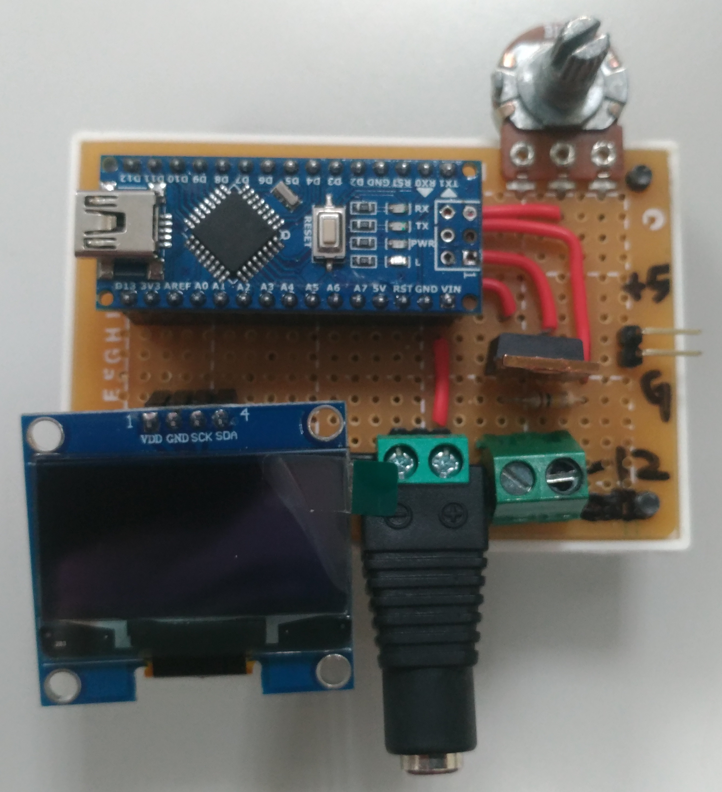

# MyHotBedControl

這是用於加熱平台控制的系統,用Arduino NANO寫成的。

透過可變電阻旋鈕調控0~99度C。

會從40度以上開始做加熱，低於40度則不加熱。

此模塊包含NTC溫度感測器/可變電阻/OLED顯示之功能。

加熱平台用一般3D列印機在用的那種DC12V加熱平台即可。

電源功率約建議120W以上，否則控制系統的供電會被加熱平台吃光而無法工作。

# 聲明

本專案開源但不建議任何商用或工程行為。

另外若因您參考本程式並調控過高溫度造成消防事件，我一概不負責。

